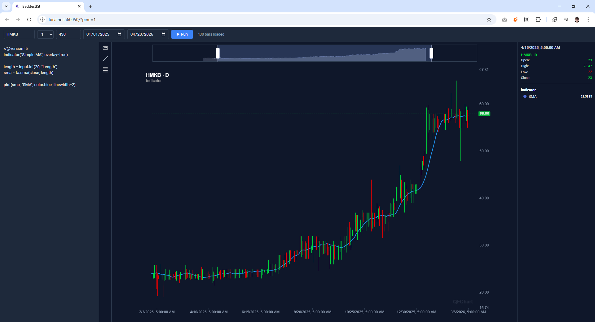

# Руководство



## Скачать историю сделок

```bash
npx tsx scripts/download-trades.ts UZ7011340005 01.03.2026 31.03.2026
```

## Импортировать сделки в MongoDb

```bash
npx tsx scripts/import-trades.ts
```

## Узнать по каким дням не работала биржа

```bash
npx tsx scripts/check-gaps.ts
```

## Создать японские свечи из дампа торгов

```bash
npx tsx scripts/build-candles.ts HMKB UZ7011340005
```

## Алгоритм построения свечей

### 1. Агрегация реальных минут

Каждая сделка из коллекции `trade-results` попадает в минутный бакет по правилу `floor(time, 1m)`.  
Внутри бакета:
- `open` — цена первой сделки
- `high` / `low` — максимальная / минимальная цена
- `close` — цена последней сделки
- `volume` — сумма `quantity` (количество бумаг)

### 2. Заполнение пропусков внутри дня

Генерируется непрерывный ряд с шагом 1 минута от `00:00` до `23:59` каждого дня.  
Минуты без сделок заполняются: `OHLC = close` предыдущей свечи, `volume = 0`.

### 3. Заполнение нерабочих дней

Выходные и праздники (дни полностью без сделок) заполняются аналогично:  
все 1440 минут дня получают `OHLC = close` последнего торгового дня, `volume = 0`.

### 4. Агрегация старших таймфреймов

Старшие таймфреймы строятся из уже заполненного 1m ряда путём группировки по `floor(timestamp, N минут)`:
- `open` — берётся из первой 1m свечи периода
- `high` / `low` — max / min по всем 1m свечам периода
- `close` — из последней 1m свечи периода
- `volume` — сумма volume всех 1m свечей периода

Поддерживаемые таймфреймы: `1m`, `3m`, `5m`, `15m`, `30m`, `1h`, `2h`, `4h`, `6h`, `8h`, `1d`.

### 5. Идемпотентность

Уникальный индекс `{ symbol, interval, timestamp }` в коллекции `candle-items` гарантирует,  
что повторный запуск скрипта не создаёт дублей — уже существующие свечи пропускаются.

## Последовательность для парсера

```js
const lines = ['#!/bin/bash', 'cd \"\$(dirname \"\$0\")/../..\"', ''];
const start = new Date(2018, 1, 1);
const end = new Date(2026, 3, 1);
let d = new Date(start);
while (d <= end) {
  const y = d.getFullYear();
  const m = d.getMonth();
  const isFirstMonth = (y === 2018 && m === 1);
  const isLastMonth  = (y === 2026 && m === 3);
  const beginDay = isFirstMonth ? '08' : '01';
  const lastDay  = new Date(y, m + 1, 0).getDate();
  const endDay   = isLastMonth ? '20' : lastDay;
  const mm = String(m + 1).padStart(2, '0');
  const beginStr = String(beginDay).padStart(2,'0') + '.' + mm + '.' + y;
  const endStr   = String(endDay).padStart(2,'0')   + '.' + mm + '.' + y;
  lines.push('npx -y tsx scripts/download-trades.ts UZ7011340005 ' + beginStr + ' ' + endStr);
  lines.push('npx -y tsx scripts/import-trades.ts');
  lines.push('');
  d.setMonth(m + 1);
}
require('fs').mkdirSync('./scripts/linux', { recursive: true });
require('fs').writeFileSync('./scripts/linux/fetch.sh', lines.join('\n'), 'utf8');
console.log('Done, lines:', lines.length);
```

## Импорт свечей в mongodb

```bash
mongoimport --db backtest --collection trade-results --file backtest.trade-results.json --jsonArray
mongoimport --db backtest --collection candle-items  --file backtest.candle-items.json  --jsonArray
```
