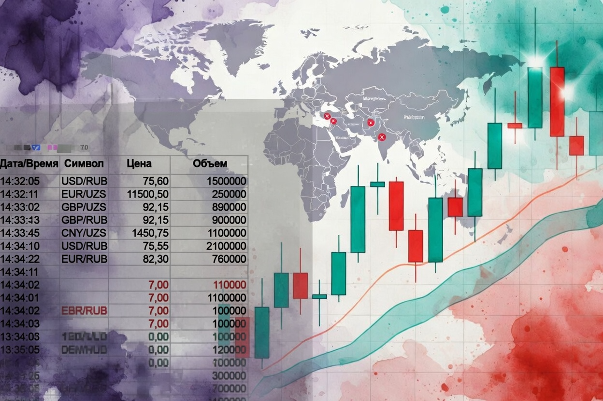
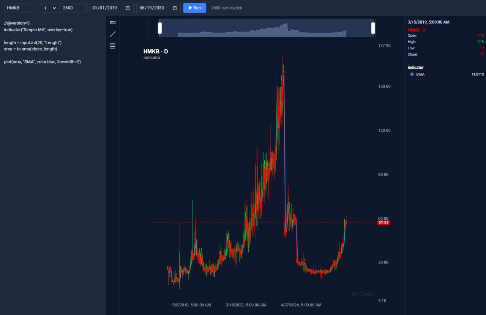
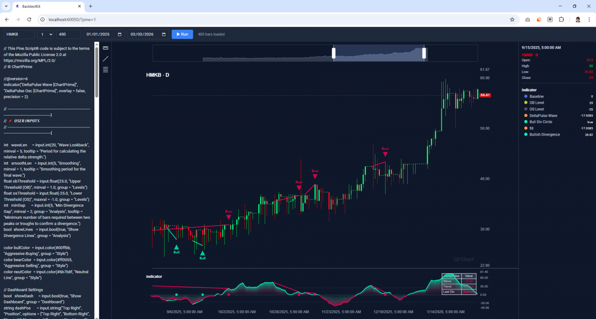
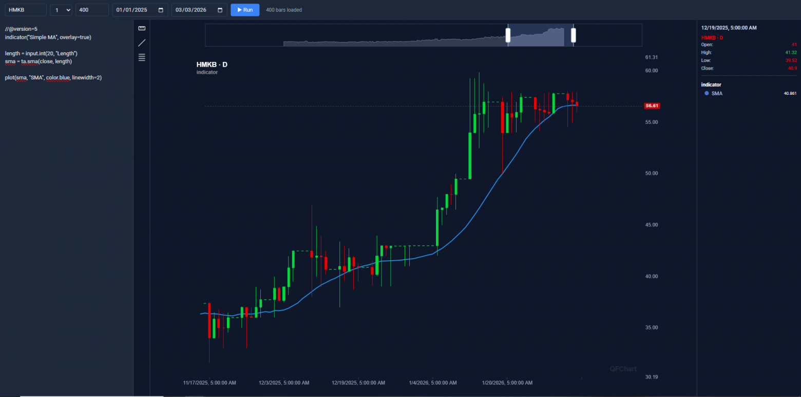

# Запускаем Pine Script на биржах без TradingView

> Исходный код, разобранный в статье, [опубликован в этом репозитории](https://github.com/backtest-kit/uzse-backtest-app)



Экосистема языка Pine Script содержит огромное количество инструментов технического анализа. Однако, сам Trading View представлен не везде. Например, региональные фондовые биржи развивающихся рынков, которых на TradingView вообще нет — ни данных, ни торговли.

- MSE (Монголия) — нет
- UZSE (Узбекистан) — нет
- DSE (Дакка, Бангладеш) — нет
- GSE (Гана) — нет
- SGBV (Алжир) — нет
- BSE (Ботсвана) — нет
- ESE (Эсватини) — нет
- MERJ (Сейшелы) — нет

## Почему просто не использовать их сайты?

Когда вместо понятного графика цены я вижу сырой aggregate trades с возможностью скачать в Excel только месяц (с учётом 6 часового рабочего дня и постоянными выходными), я чувствую себя слепым. Кнопка регистрации ведёт в никуда.


Помимо графика цены, чтобы не ограничиваться стандартным Excel, хотелось бы применить весь спектр наработок Open Source, чтобы не изобретать велосипед.


## Собираем свечи из выполненных сделок

Первый скрипт скачивает страницы с сделками. Можно было бы использовать Excel, но там не указаны минуты:

```typescript
async function main() {
  const buildUrl = (p: number) =>
    `https://uzse.uz/trade_results?begin=${begin}&end=${end}&mkt_id=${mktId}&page=${p}&search_key=${symbol}`;

  const browser = await chromium.launch({ headless: true });
  const page = await browser.newPage();

  const firstHtml = await fetchPage(page, buildUrl(1));
  fs.writeFileSync(path.join(TMP_DIR, "trades_page_1.html"), firstHtml, "utf8");

  const totalPages = getLastPage(firstHtml);
  console.log(`Total pages: ${totalPages}`);

  for (let p = 2; p <= totalPages; p++) {
    const html = await fetchPage(page, buildUrl(p));
    fs.writeFileSync(path.join(TMP_DIR, `trades_page_${p}.html`), html, "utf8");
    console.log(`Downloaded page ${p}/${totalPages}`);
  }

  await browser.close();
  console.log(`Done. HTML saved to ${TMP_DIR}`);
}
```

Второй скрипт импортирует в MongoDB:

```typescript
function parseHtmlTable(html: string, pageIndex: number) {
  const rows: object[] = [];
  const trRegex = /<tr[\s\S]*?<\/tr>/gi;
  const tdRegex = /<td[^>]*>([\s\S]*?)<\/td>/gi;
  const tagRegex = /<[^>]+>/g;
  let rowIndex = 0;
  const urlKey = extractUrlKey(html);

  let trMatch: RegExpExecArray | null;
  while ((trMatch = trRegex.exec(html)) !== null) {
    const rowHtml = trMatch[0];
    const cells: string[] = [];
    let tdMatch: RegExpExecArray | null;
    while ((tdMatch = tdRegex.exec(rowHtml)) !== null) {
      cells.push(tdMatch[1].replace(tagRegex, " ").replace(/\s+/g, " ").trim());
    }
    if (cells.length < 10) continue;

    const symbolParts = cells[2].split(/\s+/).filter(Boolean);
    const volumeParts = cells[9].split(/\s+/).filter(Boolean);

    const time = parseRuDate(cells[0]);
    const symbol = symbolParts[0] ?? "";
    const tradePrice = parseNumber(cells[7]);
    const quantity = parseNumber(cells[8]);
    const volume = parseNumber(volumeParts[volumeParts.length - 1] ?? "");
    const hash = crypto
      .createHash("sha1")
      .update(`${symbol}|${time?.toISOString()}|${tradePrice}|${quantity}|${volume}|${pageIndex}|${rowIndex}|${urlKey}`)
      .digest("hex");

    rowIndex++;
    rows.push({ time, symbol, issuer: cells[3], securityType: cells[4], market: cells[5], platform: cells[6], tradePrice, quantity, volume, hash });
  }
  return rows.filter((r: any) => r.time !== null);
}
```

## Видим график



**Торги не велись неделю с 12.08.2023 по 21.08.2023**. Выглядит страшно, уточняем Claude что произошло в этот промежуток времени. Получаем аргументированный ответ со ссылками.

**Причина обвала:** допэмиссия с увеличением уставного капитала в 3 раза.

На годовом общем собрании акционеров 26 мая 2023 года было принято решение об увеличении уставного капитала банка с 107,77 млрд сумов до 323,32 млрд сумов — **то есть в ~3 раза** — за счёт нераспределённой прибыли. Выпуск новых акций был зарегистрирован регулятором 7 августа 2023 года.

Размещение акций проходило по закрытой подписке среди существующих акционеров, включённых в реестр, сформированный на 10-й день с момента государственной регистрации выпуска — то есть реестр фиксировался примерно **17 августа 2023 года**.

Прибыль не выплачивается деньгами, а конвертируется в акции.

## Смотрим теханализ



Я взял первый попавшийся индикатор. **Вроде бы, продаём на цене красной медвежьей линии и покупаем на зелёной бычьей**. Важно, что заработала сложная визуализация.



Так же можно посмотреть историю. Видно: цена несколько раз уходила далеко выше `SMA(20)`. **Тот же паттерн: перед этим несколько дней без торгов.** Выглядит как `single-price auction day`.

## Как подключить свечи

Файл `./modules/editor.module.ts`:

```typescript
import { addExchangeSchema } from "backtest-kit";
import { CandleModel } from "../schema/Candle.schema";

import "../config/setup";

addExchangeSchema({
  exchangeName: "mongo-exchange",
  getCandles: async (symbol, interval, since, limit) => {
    const candles = await CandleModel.find(
      { symbol, interval, timestamp: { $gte: since.getTime() } },
      { timestamp: 1, open: 1, high: 1, low: 1, close: 1, volume: 1, _id: 0 }
    )
      .sort({ timestamp: 1 })
      .limit(limit)
      .lean();

    return candles.map(({ timestamp, open, high, low, close, volume }) => ({
      timestamp,
      open,
      high,
      low,
      close,
      volume,
    }));
  },
});
```

## Как запустить

Через `npm start`:

```json
{
  "name": "backtest-kit-project",
  "version": "1.0.0",
  "description": "Backtest Kit trading bot project",
  "main": "index.js",
  "homepage": "https://backtest-kit.github.io/documents/article_07_ai_news_trading_signals.html",
  "scripts": {
    "start": "node ./node_modules/@backtest-kit/cli/build/index.mjs --editor"
  },
  "keywords": [],
  "author": "",
  "license": "ISC",
  "type": "commonjs",
  "dependencies": {
    "@backtest-kit/cli": "^7.1.0",
    "@backtest-kit/graph": "^7.1.0",
    "@backtest-kit/pinets": "^7.1.0",
    "@backtest-kit/ui": "^7.1.0",
    "agent-swarm-kit": "^2.5.1",
    "backtest-kit": "^7.1.0",
    "functools-kit": "^2.2.0",
    "garch": "^1.2.3",
    "get-moment-stamp": "^1.1.2",
    "mongoose": "^8.23.0",
    "ollama": "^0.6.3",
    "playwright": "^1.59.1",
    "volume-anomaly": "^1.2.3"
  }
}
```

## Что интересно

1. **Участники рынка не могут нанять программиста Pine Script**

   Его как сложно найти на рынке, так и некуда пристроить: нет инфраструктуры Trading View. Написать визуализацию индикаторов технически сложная задача, которую ИИ не решит, нужен человек.

2. **Новостной сентимент не действует на цену акций**

   Индикатор калибруется на исторических данных. Исторические данные невалидны, если изменился сентимент рынка. [Новости Узбекистана не медийны](https://www.gazeta.uz/ru/2026/04/17/ravshan-muhitdinov/).

3. **Политика партии — инвестиции**

   Единственный источник новостей который влияет на сентимент — это президент республики. Он [назвал общей ответственностью](https://www.gazeta.uz/ru/2026/04/20/drugs/) всего международного сообщества помощь таким регионам путём инвестиций в их экономику и развитие.

---

Тут можно почитать [про влияние новостного сентимента на рынок](https://habr.com/ru/articles/1025238/).

**Это именно та причина, почему индикаторы перестали работать на крупных рынках: новое значение индикатора само по себе стало новостью.**